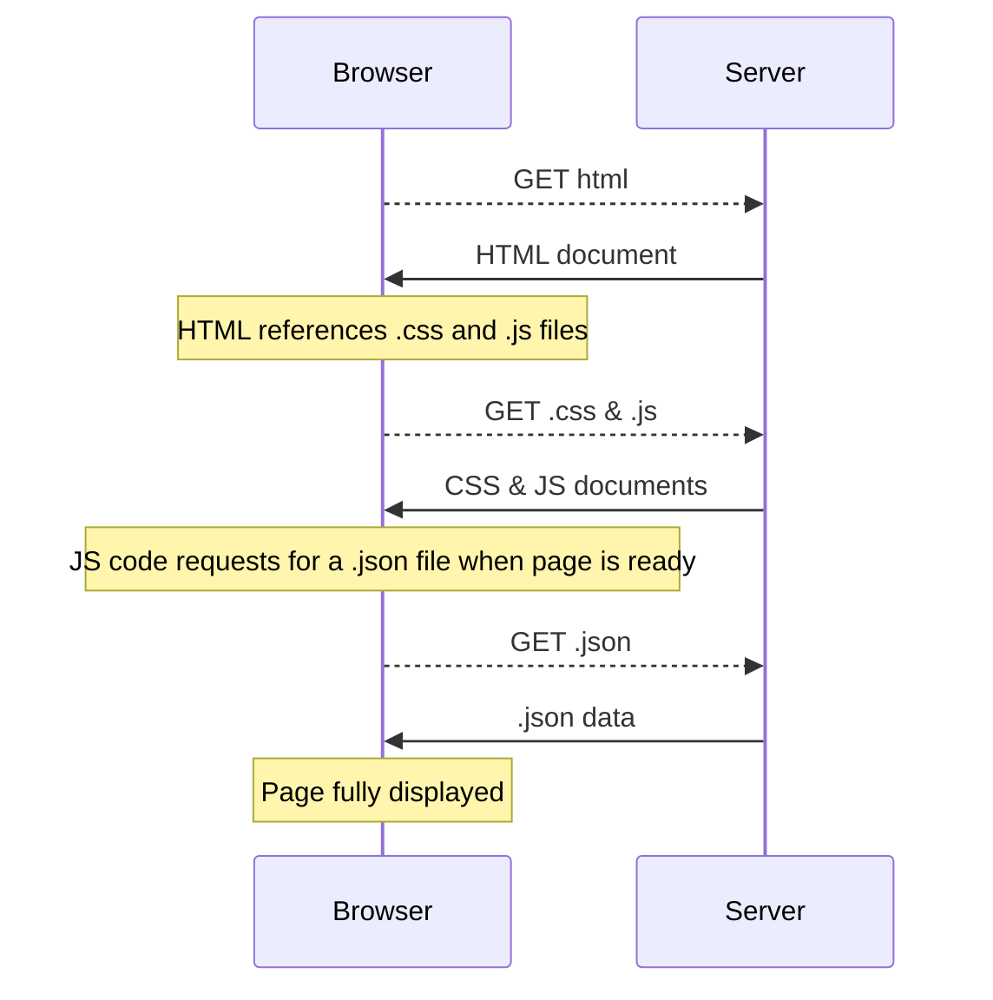

```mermaid
sequenceDiagram
    participant B as Browser
    participant S as Server

    B -->> S: GET html
    S ->> B: HTML document

    Note over B: HTML references .css and .js files
    B -->> S: GET .css & .js

    S ->> B: CSS & JS documents
    Note over B: JS code requests for a .json file when page is ready

    B -->> S: GET .json
    S ->> B: .json data

    Note over B: Page fully displayed

```