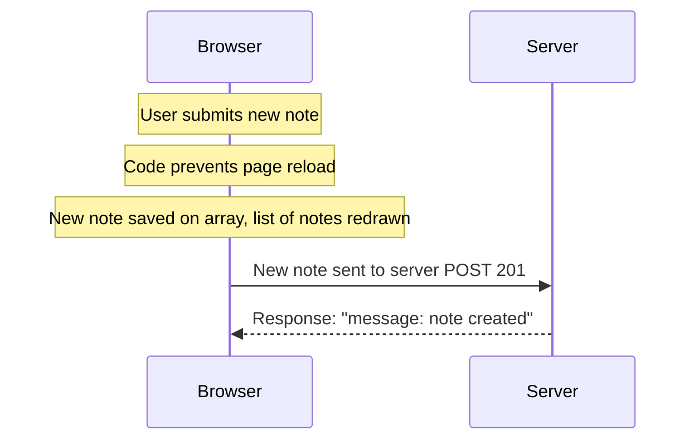

```mermaid
sequenceDiagram
    participant B as Browser
    participant S as Server

    
    Note over B: User submits new note
    Note over B: Code prevents page reload
    Note over B: New note saved on array, list of notes redrawn
    
    B ->> S: New note sent to server POST 201   
    S -->> B: Response: "message: note created"

```